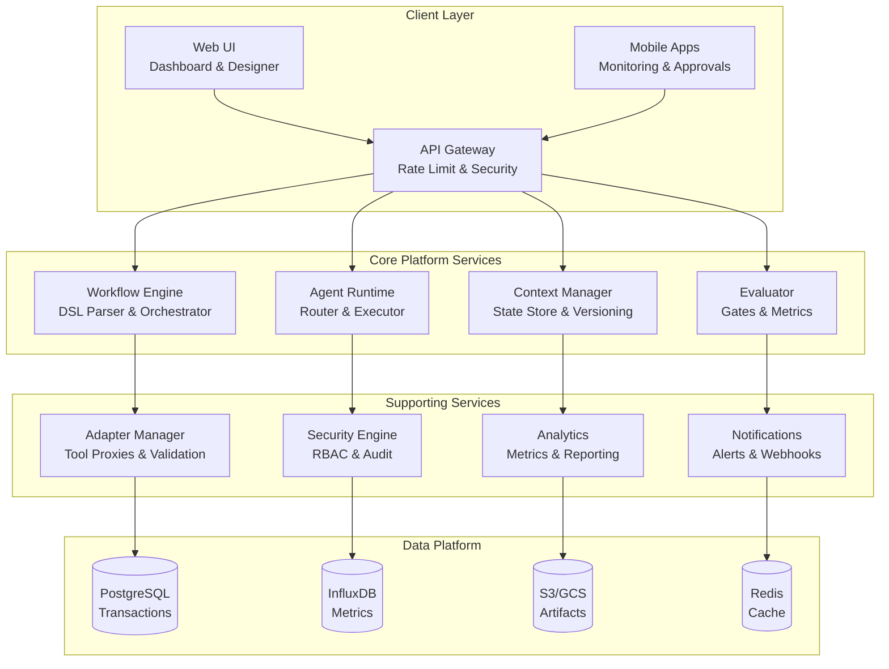
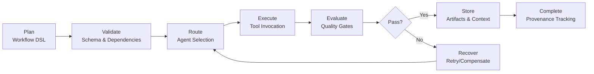
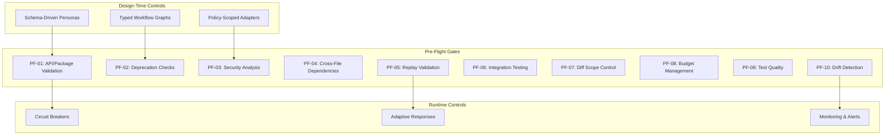

# AxiomFlow
> **Logic-First Agent Orchestration Platform**  
> *Eliminate "vibe coding" through systematic, auditable AI agent collaboration*

[](https://github.com/axiomflow/axiomflow)
[](https://github.com/axiomflow/axiomflow/releases)
[](LICENSE)
[](https://python.org)
[](https://www.typescriptlang.org/)
[](https://docker.com)

## 🎯 Overview

AxiomFlow is a **logic-first agent orchestration platform** that coordinates specialized AI agents through schema-driven workflows, deterministic context management, and evaluator-optimizer cycles. It enables reliable, auditable, and repeatable software development outcomes through multi-agent collaboration while eliminating the chaos of "vibe coding."

### ⚡ Key Features

- 🔄 **Multi-Agent Orchestration** - Intelligent routing and context-preserving handoffs between specialized agents
- 📋 **Schema-Driven Workflows** - YAML/JSON DSL for defining deterministic, auditable processes
- 🛡️ **Anti-Vibe Coding Controls** - 10 systematic gates (PF-01 to PF-10) preventing common AI failures
- 🔁 **85%+ Reproducibility** - Deterministic context management with full provenance tracking
- 🔗 **Enterprise Integrations** - 10+ built-in adapters (GitHub, Jira, Slack, OpenAI, etc.)
- 📊 **Quality Assurance Gates** - Automated evaluation and optimization cycles
- 🔐 **Security & Compliance** - RBAC, audit trails, signed adapters, SOC 2 controls

## 🏗️ System Architecture



## 🔄 Workflow Execution Flow



## 🛡️ Anti-Vibe Coding Gates (PF-01 to PF-10)

AxiomFlow implements systematic controls to prevent the top 10 AI coding failures:



| Gate | Target Metric | Description |
|------|---------------|-------------|
| **PF-01** | `< 0.5 unknown symbols/1k LOC` | API/Package existence validation |
| **PF-02** | `< 1% deprecation warnings` | Deprecated API detection |
| **PF-03** | `0 critical security findings` | SAST/DAST security scanning |
| **PF-04** | `< 1% cross-file regressions` | Dependency graph validation |
| **PF-05** | `≥ 85% replay match rate` | Deterministic execution |
| **PF-06** | `≥ 90% CI pass rate` | Integration testing |
| **PF-07** | `≤ 1.3× diff scope ratio` | Minimal change enforcement |
| **PF-08** | `< 1 rate limit/100 runs` | Budget and quota management |
| **PF-09** | `≥ 75% mutation score` | Test quality validation |
| **PF-10** | `< 1% drift failures` | Dependency drift detection |

## 🚀 Quick Start

### Prerequisites

- **Python 3.12+** and [uv](https://github.com/astral-sh/uv) package manager
- **Node.js 20+** and [pnpm](https://pnpm.io/)
- **Docker** and **Docker Compose**
- **Git** for version control

### Installation

1. **Clone the repository:**
   ```bash
   git clone https://github.com/axiomflow/axiomflow.git
   cd axiomflow
   ```

2. **Set up the backend:**
   ```bash
   cd backend
   uv install
   ```

3. **Set up the frontend:**
   ```bash
   cd frontend
   pnpm install
   ```

4. **Start the services:**
   ```bash
   # Start databases
   docker-compose up -d
   
   # Start backend (in backend/ directory)
   uv run python manage.py runserver
   
   # Start frontend (in frontend/ directory)
   pnpm dev
   ```

5. **Initialize your first project:**
   ```bash
   # Create a new project
   axiom init my-project --template=basic
   cd my-project
   
   # Run a sample workflow
   axiom run workflows/hello-world.yaml
   ```

### Verification

Visit `http://localhost:3000` to access the AxiomFlow dashboard and confirm your installation is working correctly.

## 📁 Project Structure

```
axiomflow/
├── src/                          # Primary source code
│   ├── orchestrator/             # Main orchestration service
│   ├── api/                      # REST API server
│   └── ui/                       # React frontend application
├── workflows/                    # Workflow DSL definitions and templates
├── agents/                       # Agent persona definitions and routing logic
├── adapters/                     # Tool integration adapters
│   ├── github/                   # GitHub/GitLab integration
│   ├── communication/            # Slack/Teams integration
│   └── development/              # Jira/DevOps tools
├── evaluators/                   # Gate implementations (PF-01 to PF-10)
├── tests/                        # Comprehensive test suites
│   ├── unit/                     # Unit tests
│   ├── integration/              # Integration tests
│   └── e2e/                      # End-to-end tests
├── docs/                         # Technical documentation
│   ├── prd.md                    # Product Requirements Document
│   ├── axiomflow_frd.md         # Functional Requirements Document
│   ├── axiomflow_brd.md         # Business Requirements Document
│   └── api/                      # API documentation
├── configs/                      # Environment configurations
└── schemas/                      # Workflow DSL JSON schemas
```

## 🔧 Technology Stack

### Backend
- **Python 3.12+** with **Django 5.2+** and **FastAPI**
- **PostgreSQL** for transactional data
- **Redis** for caching and session management
- **InfluxDB** for time-series metrics
- **Elasticsearch** for logging and search

### Frontend
- **React 18.x** with **TypeScript 5.x**
- **Vite** for build tooling
- **Tailwind CSS** for styling

### Infrastructure
- **Docker** and **Kubernetes** for containerization
- **Cloud-native deployment** (AWS/Azure/GCP)
- **uv** (Python) and **pnpm** (JavaScript) package managers

## 🛠️ Development Guide

### Local Development Setup

1. **Install dependencies:**
   ```bash
   # Python dependencies
   curl -LsSf https://astral.sh/uv/install.sh | sh
   cd backend && uv install
   
   # Node.js dependencies
   npm install -g pnpm
   cd frontend && pnpm install
   ```

2. **Start development services:**
   ```bash
   # Start databases
   docker-compose up -d postgres redis influxdb
   
   # Run migrations
   cd backend && uv run python manage.py migrate
   
   # Start backend
   uv run python manage.py runserver
   
   # Start frontend (new terminal)
   cd frontend && pnpm dev
   ```

### Testing

```bash
# Backend tests
cd backend
uv run pytest tests/ --cov=src/

# Frontend tests
cd frontend
pnpm test --run --coverage

# Integration tests
uv run pytest tests/integration/

# End-to-end tests
pnpm test:e2e
```

### Code Quality

```bash
# Backend linting and formatting
uv run black . && uv run isort . && uv run ruff check .

# Frontend linting and formatting
pnpm lint --fix && pnpm format

# Security scanning
uv run bandit -r src/ && pnpm audit
```

### Configuration

Configuration values are defined in YAML and may be overridden by environment
variables. Environment variables take precedence over values in the YAML file.

```python
from pathlib import Path
from axiomflow.core.config import Config

cfg = Config.load(Path("configs/orchestrator.yaml"), env_prefix="ORCHESTRATOR_")
timeout = cfg.get("workflow_timeout")
```

## 📖 Documentation

- 📋 **[Product Requirements Document (PRD)](docs/prd.md)** - Complete product vision and requirements
- 🔧 **[Functional Requirements Document (FRD)](docs/axiomflow_frd.md)** - Detailed technical specifications
- 💼 **[Business Requirements Document (BRD)](docs/axiomflow_brd.md)** - Business analysis and requirements
- 🤖 **[AI Collaboration Guide (AGENTS.md)](AGENTS.md)** - Guide for AI models working with the platform
- 🔗 **[API Documentation](docs/api/)** - Complete API reference
- 📚 **[User Guide](docs/user-guide.md)** - End-user documentation

## 🎯 Success Metrics

| Metric | Target | Current Status |
|--------|---------|---------------|
| **Workflow Success Rate** | ≥ 90% | 🚧 In Development |
| **Reproducible Run Rate** | ≥ 85% | 🚧 In Development |
| **Time-to-First-Value** | ≤ 15 minutes | 🚧 In Development |
| **p95 Step Latency** | ≤ 2 seconds | 🚧 In Development |
| **Agent Routing Accuracy** | ≥ 95% | 🚧 In Development |
| **Security Gate Pass Rate** | 100% (zero critical findings) | 🚧 In Development |

## 🤝 Contributing

We welcome contributions! Please see our [Contributing Guidelines](CONTRIBUTING.md) for details.

### Development Workflow

1. Fork the repository
2. Create a feature branch: `git checkout -b feature/amazing-feature`
3. Make your changes and add tests
4. Ensure all quality gates pass: `make test lint security`
5. Commit using conventional commits: `feat: add amazing feature`
6. Push to your fork and submit a pull request

### Code Standards

- **Python**: Follow PEP 8, use Black formatter, 100-character line limit
- **TypeScript**: Use Prettier, 2-space indentation, single quotes
- **Documentation**: All public APIs must have comprehensive docstrings
- **Testing**: Maintain >80% branch coverage, >60% mutation score

## 📄 License

This project is licensed under the Apache License 2.0 - see the [LICENSE](LICENSE) file for details.

## 🏆 Acknowledgments

- Built with modern AI/ML best practices in mind
- Inspired by the need for systematic, auditable AI agent collaboration
- Designed for enterprise-grade reliability and security

---

**Status**: 🚧 In Active Development  
**Last Updated**: September 1, 2025  
**Next Milestone**: M1 - MVP Spec Lock

<details>
<summary>📊 Project Metrics Dashboard</summary>

### Development Progress
- [ ] M0: PRD Approved
- [ ] M1: MVP Spec Locked
- [ ] M2: Alpha (Internal)
- [ ] M3: Beta (Limited)
- [ ] M4: GA Release

### Anti-Vibe Gate Status
- [ ] PF-01: API/Package Validation
- [ ] PF-02: Deprecation Checks  
- [ ] PF-03: Security Analysis
- [ ] PF-04: Cross-File Dependencies
- [ ] PF-05: Replay Validation
- [ ] PF-06: Integration Testing
- [ ] PF-07: Diff Scope Control
- [ ] PF-08: Budget Management
- [ ] PF-09: Test Quality
- [ ] PF-10: Drift Detection

</details>

---

> 💡 **New to AxiomFlow?** Start with our [Quick Start Guide](#-quick-start) or explore the [Product Requirements Document](docs/prd.md) to understand our vision for eliminating "vibe coding" in AI-assisted development.
